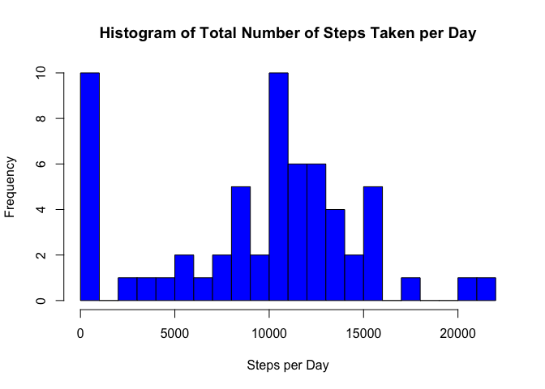
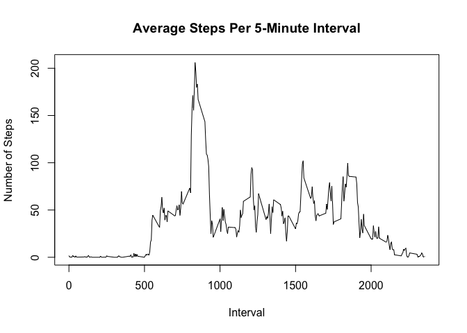
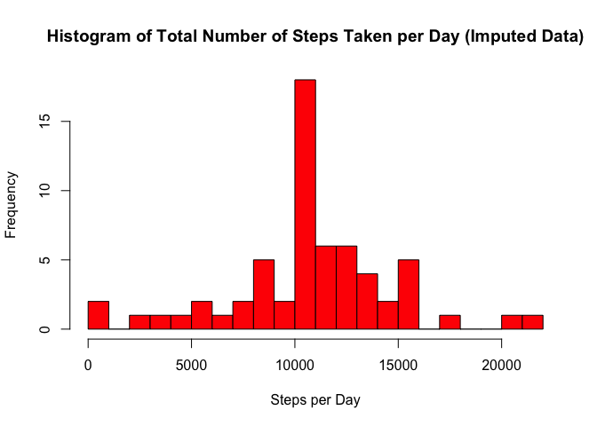
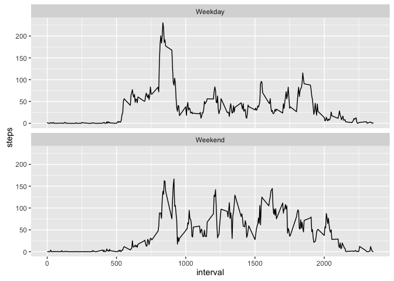

# Reproducible Research: Peer Assessment 1

## Loading and preprocessing the data
This assignment makes use of data from a personal activity monitoring device. This device collects data at 5 minute intervals through out the day. The data consists of two months of data from an anonymous individual collected during the months of October and November, 2012 and include the number of steps taken in 5 minute intervals each day.

Activity data should have been downloaded and available in the Working Directory. Here is the structure of the activity data.


```r
activitydata <- read.csv("activity.csv")

str(activitydata)
```

```
## 'data.frame':	17568 obs. of  3 variables:
##  $ steps   : int  NA NA NA NA NA NA NA NA NA NA ...
##  $ date    : Factor w/ 61 levels "2012-10-01","2012-10-02",..: 1 1 1 1 1 1 1 1 1 1 ...
##  $ interval: int  0 5 10 15 20 25 30 35 40 45 ...
```

## What is the total number of steps taken per day?
This histogram displays the total number of steps taken per day while ignoring missing values.


```r
activitydata.date <- aggregate(activitydata[1], by = activitydata[2], FUN = sum, na.rm = TRUE)

hist(activitydata.date$steps, breaks = 20, col = "blue", main = "Histogram of Total Number of Steps Taken per Day", xlab = "Steps per Day")
```



```r
mean(activitydata.date$steps)   # mean number of steps taken per day (excluding missing values)
```

```
## [1] 9354.23
```

```r
median(activitydata.date$steps) # median number of steps taken per day (excluding missing values)
```

```
## [1] 10395
```

## What is the average daily activity pattern?
Following is a plot of the average number of steps taken during each 5-minute interval during the day.


```r
# The following data set contains the activity data aggregated by interval.
activitydata.interval <- aggregate(activitydata[1], by = activitydata[3], FUN = mean, na.rm = TRUE)

plot(x = activitydata.interval$interval, y = activitydata.interval$steps, type = "l", main = "Average Steps Per 5-Minute Interval", xlab = "Interval", ylab = "Number of Steps")
```



**Maximum Steps**

```r
activitydata.maxinterval <- activitydata.interval[activitydata.interval$steps == max(activitydata.interval$steps),]

activitydata.maxinterval[1] # interval with the maximum number of steps
```

```
##     interval
## 104      835
```

```r
round(activitydata.maxinterval[2],1) # maximum number of steps per this 5 minute interval
```

```
##     steps
## 104 206.2
```

## Imputing missing values
**Item 1 - Number of Missing Values**

```r
nrow(activitydata) # total records in activity data set
```

```
## [1] 17568
```

```r
sum(is.na(activitydata$steps)) # total missing records in activity data set
```

```
## [1] 2304
```

**Items 2 and 3 - Replacing Missing Values and Creating a New Dataset**
Missing values for steps per interval are replaced by the mean number of steps for that interval, calculated on the non-missing rows.  A new dataset is created that contains these imputed values.

```r
library(plyr)

activitydata.meanimpute <- function(x) replace(x, is.na(x), mean(x, na.rm = TRUE))

activitydata.impute <- ddply(activitydata, ~interval, transform, steps = activitydata.meanimpute(steps))
```

**Item 4 - Histogram, Mean and Median**

The following histogram is of the total number of steps per day using imputed values for missing values.

```r
# The following data set contains the activity data aggregated by date.
activitydata.dateimpute <- aggregate(activitydata.impute[1], by = activitydata.impute[2], FUN = sum, na.rm = TRUE)

hist(activitydata.dateimpute$steps, breaks = 20, col = "red", main = "Histogram of Total Number of Steps Taken per Day (Imputed Data)", xlab = "Steps per Day")
```



```r
mean(activitydata.dateimpute$steps)   # mean number of steps taken per day rounded to nearest step (excluding missing values)
```

```
## [1] 10766.19
```

```r
median(activitydata.dateimpute$steps) # median number of steps taken per day rounded to nearest step (excluding missing values)
```

```
## [1] 10766.19
```

This means of value imputation has increased both the mean and the median values from those calculated in the first part of the assignment.  Furthermore, given the number of missing values replaced, the median values contain the mean values imputed to them.  This approach may overweigh the central tendency and underweigh the upper and lower extremes, and another system of imputation may result more reliable results. 

## Are there differences in activity patterns between weekdays and weekends?
**Item 1 - New Factor Variable**

A new factor variable, Day, is created, indicating whether a record pertains to a weekday or to a weekend.

```r
activitydata.impute$dateP <- as.POSIXlt(activitydata.impute$date, format = "%Y-%m-%d")

activitydata.impute$day <- "Weekday"

activitydata.impute$day [weekdays(activitydata.impute$dateP) %in% c("Saturday", "Sunday")] <- "Weekend"
```

**Item 2 - Weekday/Weekend Comparison**

The following time series plots display the Weekday and Weekend activity data separately.  

```r
activitydata.intervalimpute <- aggregate(activitydata.impute[1], by = activitydata.impute[c(3,5)], FUN = mean, na.rm = TRUE)

library(ggplot2)

plot <- ggplot(data = activitydata.intervalimpute, aes(x = interval, y = steps))

plot + geom_line() + facet_wrap(~day, nrow = 2)
```


